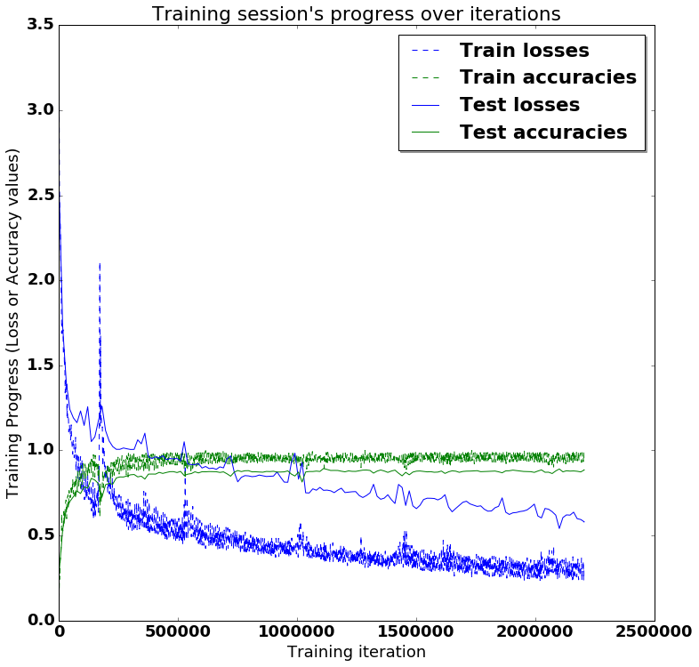
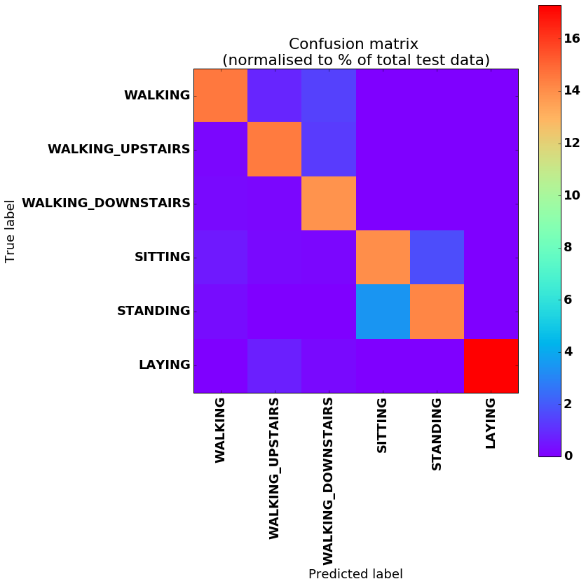

# LSTM for Human Activity Recognition

Human activity recognition using smartphones dataset and an LSTM RNN. Classifying the type of movement amongst six categories:
- WALKING,
- WALKING_UPSTAIRS,
- WALKING_DOWNSTAIRS,
- SITTING,
- STANDING,
- LAYING.


## Video dataset overview

Follow this link to see a video of the 6 activities recorded in the experiment with one of the participants:

<a href="http://www.youtube.com/watch?feature=player_embedded&v=XOEN9W05_4A
" target="_blank"></a>
<a href="https://youtu.be/XOEN9W05_4A"><center>[Watch video]</center></a>

## Details

I will be using an LSTM on the data to learn (as a cellphone attached on the waist) to recognise the type of activity that the user is doing. The dataset's description goes like this:

> The sensor signals (accelerometer and gyroscope) were pre-processed by applying noise filters and then sampled in fixed-width sliding windows of 2.56 sec and 50% overlap (128 readings/window). The sensor acceleration signal, which has gravitational and body motion components, was separated using a Butterworth low-pass filter into body acceleration and gravity. The gravitational force is assumed to have only low frequency components, therefore a filter with 0.3 Hz cutoff frequency was used. 

That said, I will use the almost raw data: only the gravity effect has been filtered out of the accelerometer  as a preprocessing step for another 3D feature as an input to help learning. 


## Results 

Scroll on! Nice visuals awaits. 


```python
# All Includes

import numpy as np
import matplotlib
import matplotlib.pyplot as plt
import tensorflow as tf  # Version r0.10
from sklearn import metrics

import os
```


```python
# Useful Constants

# Those are separate normalised input features for the neural network
INPUT_SIGNAL_TYPES = [
    "body_acc_x_",
    "body_acc_y_",
    "body_acc_z_",
    "body_gyro_x_",
    "body_gyro_y_",
    "body_gyro_z_",
    "total_acc_x_",
    "total_acc_y_",
    "total_acc_z_"
]

# Output classes to learn how to classify
LABELS = [
    "WALKING", 
    "WALKING_UPSTAIRS", 
    "WALKING_DOWNSTAIRS", 
    "SITTING", 
    "STANDING", 
    "LAYING"
] 

```

## Let's start by downloading the data: 


```python
# Note: Linux bash commands start with a "!" inside those "ipython notebook" cells

DATA_PATH = "data/"

!pwd && ls
os.chdir(DATA_PATH)
!pwd && ls

!python download_dataset.py

!pwd && ls
os.chdir("..")
!pwd && ls

DATASET_PATH = DATA_PATH + "UCI HAR Dataset/"
print("\n" + "Dataset is now located at: " + DATASET_PATH)

```

    /Users/youwei.tan/Downloads/LSTM-Human-Activity-Recognition-master
    LICENSE    LSTM.ipynb LSTM_files README.md  data       lstm.py
    /Users/youwei.tan/Downloads/LSTM-Human-Activity-Recognition-master/data
    download_dataset.py source.txt
    
    Downloading...
    /bin/sh: wget: command not found
    Downloading done.
    
    Extracting...
    unzip:  cannot find or open UCI HAR Dataset.zip, UCI HAR Dataset.zip.zip or UCI HAR Dataset.zip.ZIP.
    Extracting successfully done to /Users/youwei.tan/Downloads/LSTM-Human-Activity-Recognition-master/data/UCI HAR Dataset.
    /Users/youwei.tan/Downloads/LSTM-Human-Activity-Recognition-master/data
    download_dataset.py source.txt
    /Users/youwei.tan/Downloads/LSTM-Human-Activity-Recognition-master
    LICENSE    LSTM.ipynb LSTM_files README.md  data       lstm.py
    
    Dataset is now located at: data/UCI HAR Dataset/


## Preparing dataset:


```python
TRAIN = "train/"
TEST = "test/"


# Load "X" (the neural network's training and testing inputs)

def load_X(X_signals_paths):
    X_signals = []
    
    for signal_type_path in X_signals_paths:
        file = open(signal_type_path, 'rb')
        # Read dataset from disk, dealing with text files' syntax
        X_signals.append(
            [np.array(serie, dtype=np.float32) for serie in [
                row.replace('  ', ' ').strip().split(' ') for row in file
            ]]
        )
        file.close()
    
    return np.transpose(np.array(X_signals), (1, 2, 0))

X_train_signals_paths = [
    DATASET_PATH + TRAIN + "Inertial Signals/" + signal + "train.txt" for signal in INPUT_SIGNAL_TYPES
]
X_test_signals_paths = [
    DATASET_PATH + TEST + "Inertial Signals/" + signal + "test.txt" for signal in INPUT_SIGNAL_TYPES
]

X_train = load_X(X_train_signals_paths)
X_test = load_X(X_test_signals_paths)


# Load "y" (the neural network's training and testing outputs)

def load_y(y_path):
    file = open(y_path, 'rb')
    # Read dataset from disk, dealing with text file's syntax
    y_ = np.array(
        [elem for elem in [
            row.replace('  ', ' ').strip().split(' ') for row in file
        ]], 
        dtype=np.int32
    )
    file.close()
    
    # Substract 1 to each output class for friendly 0-based indexing 
    return y_ - 1

y_train_path = DATASET_PATH + TRAIN + "y_train.txt"
y_test_path = DATASET_PATH + TEST + "y_test.txt"

y_train = load_y(y_train_path)
y_test = load_y(y_test_path)

```

## Additionnal Parameters:

Here are some core parameter definitions for the training. 

The whole neural network's structure could be summarised by enumerating those parameters and the fact an LSTM is used. 


```python

# Input Data 

training_data_count = len(X_train)  # 7352 training series (with 50% overlap between each serie)
test_data_count = len(X_test)  # 2947 testing series
n_steps = len(X_train[0])  # 128 timesteps per series
n_input = len(X_train[0][0])  # 9 input parameters per timestep


# LSTM Neural Network's internal structure

n_hidden = 32 # Hidden layer num of features
n_classes = 6 # Total classes (should go up, or should go down)


# Training 

learning_rate = 0.0025
lambda_loss_amount = 0.0015
training_iters = training_data_count * 300  # Loop 300 times on the dataset
batch_size = 1500
display_iter = 15000  # To show test set accuracy during training


# Some debugging info

print "Some useful info to get an insight on dataset's shape and normalisation:"
print "(X shape, y shape, every X's mean, every X's standard deviation)"
print (X_test.shape, y_test.shape, np.mean(X_test), np.std(X_test))
print "The dataset is therefore properly normalised, as expected, but not yet one-hot encoded."

```

    Some useful info to get an insight on dataset's shape and normalisation:
    (X shape, y shape, every X's mean, every X's standard deviation)
    ((2947, 128, 9), (2947, 1), 0.099139921, 0.39567086)
    The dataset is therefore properly normalised, as expected, but not yet one-hot encoded.


## Utility functions for training:


```python
def LSTM_RNN(_X, _weights, _biases):
    # Function returns a tensorflow LSTM (RNN) artificial neural network from given parameters. 
    # Moreover, two LSTM cells are stacked which adds deepness to the neural network. 
    # Note, some code of this notebook is inspired from an slightly different 
    # RNN architecture used on another dataset: 
    # https://tensorhub.com/aymericdamien/tensorflow-rnn

    # (NOTE: This step could be greatly optimised by shaping the dataset once
    # input shape: (batch_size, n_steps, n_input)
    _X = tf.transpose(_X, [1, 0, 2])  # permute n_steps and batch_size
    # Reshape to prepare input to hidden activation
    _X = tf.reshape(_X, [-1, n_input]) 
    # new shape: (n_steps*batch_size, n_input)
    
    # Linear activation
    _X = tf.matmul(_X, _weights['hidden']) + _biases['hidden']
    # Split data because rnn cell needs a list of inputs for the RNN inner loop
    _X = tf.split(0, n_steps, _X) 
    # new shape: n_steps * (batch_size, n_hidden)

    # Define two stacked LSTM cells (two recurrent layers deep) with tensorflow
    lstm_cell_1 = tf.nn.rnn_cell.BasicLSTMCell(n_hidden, forget_bias=1.0, state_is_tuple=True)
    lstm_cell_2 = tf.nn.rnn_cell.BasicLSTMCell(n_hidden, forget_bias=1.0, state_is_tuple=True)
    lstm_cells = tf.nn.rnn_cell.MultiRNNCell([lstm_cell_1, lstm_cell_2], state_is_tuple=True)
    # Get LSTM cell output
    outputs, states = tf.nn.rnn(lstm_cells, _X, dtype=tf.float32)

    # Linear activation
    # Get inner loop last output
    return tf.matmul(outputs[-1], _weights['out']) + _biases['out']


def extract_batch_size(_train, step, batch_size):
    # Function to fetch a "batch_size" amount of data from "(X|y)_train" data. 
    
    shape = list(_train.shape)
    shape[0] = batch_size
    batch_s = np.empty(shape)

    for i in range(batch_size):
        # Loop index
        index = ((step-1)*batch_size + i) % len(_train)
        batch_s[i] = _train[index] 

    return batch_s


def one_hot(y_):
    # Function to encode output labels from number indexes 
    # e.g.: [[5], [0], [3]] --> [[0, 0, 0, 0, 0, 1], [1, 0, 0, 0, 0, 0], [0, 0, 0, 1, 0, 0]]
    
    y_ = y_.reshape(len(y_))
    n_values = np.max(y_) + 1
    return np.eye(n_values)[np.array(y_, dtype=np.int32)]  # Returns FLOATS

```

## Let's get serious and build the neural network:


```python

# Graph input/output
x = tf.placeholder(tf.float32, [None, n_steps, n_input])
y = tf.placeholder(tf.float32, [None, n_classes])

# Graph weights
weights = {
    'hidden': tf.Variable(tf.random_normal([n_input, n_hidden])), # Hidden layer weights
    'out': tf.Variable(tf.random_normal([n_hidden, n_classes]))
}
biases = {
    'hidden': tf.Variable(tf.random_normal([n_hidden])),
    'out': tf.Variable(tf.random_normal([n_classes]))
}

pred = LSTM_RNN(x, weights, biases)

# Loss, optimizer and evaluation
l2 = lambda_loss_amount * sum(
    tf.nn.l2_loss(tf_var) for tf_var in tf.trainable_variables()
) # L2 loss prevents this overkill neural network to overfit the data
cost = tf.reduce_mean(tf.nn.softmax_cross_entropy_with_logits(pred, y)) + l2 # Softmax loss
optimizer = tf.train.AdamOptimizer(learning_rate=learning_rate).minimize(cost) # Adam Optimizer

correct_pred = tf.equal(tf.argmax(pred,1), tf.argmax(y,1))
accuracy = tf.reduce_mean(tf.cast(correct_pred, tf.float32))

```

## Hooray, now train the neural network:


```python
# To keep track of training's performance
test_losses = []
test_accuracies = []
train_losses = []
train_accuracies = []

# Launch the graph
sess = tf.InteractiveSession(config=tf.ConfigProto(log_device_placement=True))
init = tf.initialize_all_variables()
sess.run(init)

# Perform Training steps with "batch_size" iterations at each loop
step = 1
while step * batch_size <= training_iters:
    batch_xs =         extract_batch_size(X_train, step, batch_size)
    batch_ys = one_hot(extract_batch_size(y_train, step, batch_size))

    # Fit training using batch data
    _, loss, acc = sess.run(
        [optimizer, cost, accuracy],
        feed_dict={
            x: batch_xs, 
            y: batch_ys
        }
    )
    train_losses.append(loss)
    train_accuracies.append(acc)
    
    # Evaluate network only at some steps for faster training: 
    if (step*batch_size % display_iter == 0) or (step == 1) or (step * batch_size > training_iters):
        
        # To not spam console, show training accuracy/loss in this "if"
        print "Training iter #" + str(step*batch_size) + \
              ":   Batch Loss = " + "{:.6f}".format(loss) + \
              ", Accuracy = {}".format(acc)
        
        # Evaluation on the test set (no learning made here - just evaluation for diagnosis)
        loss, acc = sess.run(
            [cost, accuracy], 
            feed_dict={
                x: X_test,
                y: one_hot(y_test)
            }
        )
        test_losses.append(loss)
        test_accuracies.append(acc)
        print "PERFORMANCE ON TEST SET: " + \
              "Batch Loss = {}".format(loss) + \
              ", Accuracy = {}".format(acc)

    step += 1

print "Optimization Finished!"

# Accuracy for test data

one_hot_predictions, accuracy, final_loss = sess.run(
    [pred, accuracy, cost],
    feed_dict={
        x: X_test,
        y: one_hot(y_test)
    }
)

test_losses.append(final_loss)
test_accuracies.append(accuracy)

print "FINAL RESULT: " + \
      "Batch Loss = {}".format(final_loss) + \
      ", Accuracy = {}".format(accuracy)

```

    /Applications/anaconda/lib/python2.7/site-packages/numpy/lib/twodim_base.py:233: VisibleDeprecationWarning: using a non-integer number instead of an integer will result in an error in the future
      m = zeros((N, M), dtype=dtype)
    /Applications/anaconda/lib/python2.7/site-packages/numpy/lib/twodim_base.py:240: VisibleDeprecationWarning: using a non-integer number instead of an integer will result in an error in the future
      m[:M-k].flat[i::M+1] = 1


    Training iter #1500:   Batch Loss = 3.148357, Accuracy = 0.127333328128
    PERFORMANCE ON TEST SET: Batch Loss = 2.54736757278, Accuracy = 0.279945701361
    Training iter #15000:   Batch Loss = 1.743741, Accuracy = 0.533333361149
    PERFORMANCE ON TEST SET: Batch Loss = 1.72736787796, Accuracy = 0.535459816456
    Training iter #30000:   Batch Loss = 1.351158, Accuracy = 0.708666682243
    PERFORMANCE ON TEST SET: Batch Loss = 1.4021269083, Accuracy = 0.650152683258
    Training iter #45000:   Batch Loss = 1.151712, Accuracy = 0.731333315372
    PERFORMANCE ON TEST SET: Batch Loss = 1.24136257172, Accuracy = 0.699694633484
    Training iter #60000:   Batch Loss = 1.042880, Accuracy = 0.784666657448
    PERFORMANCE ON TEST SET: Batch Loss = 1.19093132019, Accuracy = 0.728537499905
    Training iter #75000:   Batch Loss = 0.936075, Accuracy = 0.819333314896
    PERFORMANCE ON TEST SET: Batch Loss = 1.16330194473, Accuracy = 0.761452317238
    Training iter #90000:   Batch Loss = 0.923416, Accuracy = 0.812666654587
    PERFORMANCE ON TEST SET: Batch Loss = 1.23206925392, Accuracy = 0.746861219406
    Training iter #105000:   Batch Loss = 0.806470, Accuracy = 0.874666690826
    PERFORMANCE ON TEST SET: Batch Loss = 1.14679086208, Accuracy = 0.786901950836
    Training iter #120000:   Batch Loss = 0.764664, Accuracy = 0.885999977589
    PERFORMANCE ON TEST SET: Batch Loss = 1.25704717636, Accuracy = 0.778418719769
    Training iter #135000:   Batch Loss = 0.690275, Accuracy = 0.925333321095
    PERFORMANCE ON TEST SET: Batch Loss = 1.05175471306, Accuracy = 0.836104512215
    Training iter #150000:   Batch Loss = 0.636671, Accuracy = 0.941333353519
    PERFORMANCE ON TEST SET: Batch Loss = 1.08021306992, Accuracy = 0.825924694538
    Training iter #165000:   Batch Loss = 0.809872, Accuracy = 0.853999972343
    PERFORMANCE ON TEST SET: Batch Loss = 1.17435479164, Accuracy = 0.80556499958
    Training iter #180000:   Batch Loss = 1.137143, Accuracy = 0.740666687489
    PERFORMANCE ON TEST SET: Batch Loss = 1.2606856823, Accuracy = 0.72548353672
    Training iter #195000:   Batch Loss = 0.909017, Accuracy = 0.860000014305
    PERFORMANCE ON TEST SET: Batch Loss = 1.11653745174, Accuracy = 0.798439085484
    Training iter #210000:   Batch Loss = 0.845075, Accuracy = 0.862666666508
    PERFORMANCE ON TEST SET: Batch Loss = 1.05591309071, Accuracy = 0.806582987309
    Training iter #225000:   Batch Loss = 0.839944, Accuracy = 0.837333321571
    PERFORMANCE ON TEST SET: Batch Loss = 1.0229421854, Accuracy = 0.801832377911
    Training iter #240000:   Batch Loss = 0.682957, Accuracy = 0.89200001955
    PERFORMANCE ON TEST SET: Batch Loss = 1.00664889812, Accuracy = 0.838140487671
    Training iter #255000:   Batch Loss = 0.608404, Accuracy = 0.934666693211
    PERFORMANCE ON TEST SET: Batch Loss = 1.00654137135, Accuracy = 0.84424841404
    Training iter #270000:   Batch Loss = 0.587701, Accuracy = 0.924666643143
    PERFORMANCE ON TEST SET: Batch Loss = 1.01442861557, Accuracy = 0.843909084797
    Training iter #285000:   Batch Loss = 0.554723, Accuracy = 0.967333316803
    PERFORMANCE ON TEST SET: Batch Loss = 1.00963008404, Accuracy = 0.850016951561
    Training iter #300000:   Batch Loss = 0.532410, Accuracy = 0.98400002718
    PERFORMANCE ON TEST SET: Batch Loss = 1.00565767288, Accuracy = 0.856803536415
    Training iter #315000:   Batch Loss = 0.522019, Accuracy = 0.995999991894
    PERFORMANCE ON TEST SET: Batch Loss = 1.00622427464, Accuracy = 0.858500182629
    Training iter #330000:   Batch Loss = 0.604647, Accuracy = 0.960666656494
    PERFORMANCE ON TEST SET: Batch Loss = 1.06249129772, Accuracy = 0.844587743282
    Training iter #345000:   Batch Loss = 0.600665, Accuracy = 0.945333361626
    PERFORMANCE ON TEST SET: Batch Loss = 1.03874969482, Accuracy = 0.84865963459
    Training iter #360000:   Batch Loss = 0.607706, Accuracy = 0.93599998951
    PERFORMANCE ON TEST SET: Batch Loss = 1.10129165649, Accuracy = 0.831693232059
    Training iter #375000:   Batch Loss = 0.623226, Accuracy = 0.925333321095
    PERFORMANCE ON TEST SET: Batch Loss = 0.962027907372, Accuracy = 0.860875487328
    Training iter #390000:   Batch Loss = 0.604275, Accuracy = 0.935333311558
    PERFORMANCE ON TEST SET: Batch Loss = 0.95239508152, Accuracy = 0.86121481657
    Training iter #405000:   Batch Loss = 0.569323, Accuracy = 0.952666640282
    PERFORMANCE ON TEST SET: Batch Loss = 0.962643027306, Accuracy = 0.860875487328
    Training iter #420000:   Batch Loss = 0.524600, Accuracy = 0.944666683674
    PERFORMANCE ON TEST SET: Batch Loss = 0.953836798668, Accuracy = 0.871055305004
    Training iter #435000:   Batch Loss = 0.534037, Accuracy = 0.942666649818
    PERFORMANCE ON TEST SET: Batch Loss = 0.969174742699, Accuracy = 0.864947378635
    Training iter #450000:   Batch Loss = 0.517659, Accuracy = 0.956666648388
    PERFORMANCE ON TEST SET: Batch Loss = 0.946664333344, Accuracy = 0.870376646519
    Training iter #465000:   Batch Loss = 0.535172, Accuracy = 0.945999979973
    PERFORMANCE ON TEST SET: Batch Loss = 0.95198905468, Accuracy = 0.875127255917
    Training iter #480000:   Batch Loss = 0.526344, Accuracy = 0.945999979973
    PERFORMANCE ON TEST SET: Batch Loss = 0.950860857964, Accuracy = 0.875466585159
    Training iter #495000:   Batch Loss = 0.484024, Accuracy = 0.974666655064
    PERFORMANCE ON TEST SET: Batch Loss = 0.952418088913, Accuracy = 0.870037317276
    Training iter #510000:   Batch Loss = 0.495234, Accuracy = 0.967999994755
    PERFORMANCE ON TEST SET: Batch Loss = 0.937225461006, Accuracy = 0.87682390213
    Training iter #525000:   Batch Loss = 0.473811, Accuracy = 0.977333307266
    PERFORMANCE ON TEST SET: Batch Loss = 1.0510559082, Accuracy = 0.852731585503
    Training iter #540000:   Batch Loss = 0.659976, Accuracy = 0.885333359241
    PERFORMANCE ON TEST SET: Batch Loss = 0.920558750629, Accuracy = 0.860536158085
    Training iter #555000:   Batch Loss = 0.644292, Accuracy = 0.865999996662
    PERFORMANCE ON TEST SET: Batch Loss = 0.917019188404, Accuracy = 0.863929390907
    Training iter #570000:   Batch Loss = 0.586543, Accuracy = 0.911333322525
    PERFORMANCE ON TEST SET: Batch Loss = 0.916933476925, Accuracy = 0.874448597431
    Training iter #585000:   Batch Loss = 0.599964, Accuracy = 0.91333335638
    PERFORMANCE ON TEST SET: Batch Loss = 0.922187745571, Accuracy = 0.86800134182
    Training iter #600000:   Batch Loss = 0.574214, Accuracy = 0.921333312988
    PERFORMANCE ON TEST SET: Batch Loss = 0.896675169468, Accuracy = 0.874787926674
    Training iter #615000:   Batch Loss = 0.471084, Accuracy = 0.972000002861
    PERFORMANCE ON TEST SET: Batch Loss = 0.905696868896, Accuracy = 0.874448597431
    Training iter #630000:   Batch Loss = 0.433763, Accuracy = 0.985333323479
    PERFORMANCE ON TEST SET: Batch Loss = 0.893522560596, Accuracy = 0.875805914402
    Training iter #645000:   Batch Loss = 0.441550, Accuracy = 0.986000001431
    PERFORMANCE ON TEST SET: Batch Loss = 0.895987391472, Accuracy = 0.875127255917
    Training iter #660000:   Batch Loss = 0.438402, Accuracy = 0.98400002718
    PERFORMANCE ON TEST SET: Batch Loss = 0.888998150826, Accuracy = 0.874787926674
    Training iter #675000:   Batch Loss = 0.424621, Accuracy = 0.986666679382
    PERFORMANCE ON TEST SET: Batch Loss = 0.903406620026, Accuracy = 0.870715975761
    Training iter #690000:   Batch Loss = 0.409715, Accuracy = 0.994000017643
    PERFORMANCE ON TEST SET: Batch Loss = 0.897452116013, Accuracy = 0.874109268188
    Training iter #705000:   Batch Loss = 0.489257, Accuracy = 0.95733332634
    PERFORMANCE ON TEST SET: Batch Loss = 0.951276063919, Accuracy = 0.862572133541
    Training iter #720000:   Batch Loss = 0.503474, Accuracy = 0.94866669178
    PERFORMANCE ON TEST SET: Batch Loss = 0.967745780945, Accuracy = 0.84865963459
    Training iter #735000:   Batch Loss = 0.499410, Accuracy = 0.948000013828
    PERFORMANCE ON TEST SET: Batch Loss = 0.87435811758, Accuracy = 0.872073292732
    Training iter #750000:   Batch Loss = 0.499442, Accuracy = 0.939333319664
    PERFORMANCE ON TEST SET: Batch Loss = 0.815615773201, Accuracy = 0.881913781166
    Training iter #765000:   Batch Loss = 0.500196, Accuracy = 0.939333319664
    PERFORMANCE ON TEST SET: Batch Loss = 0.841922044754, Accuracy = 0.875805914402
    Training iter #780000:   Batch Loss = 0.404263, Accuracy = 0.961333334446
    PERFORMANCE ON TEST SET: Batch Loss = 0.851925075054, Accuracy = 0.8805565238
    Training iter #795000:   Batch Loss = 0.415692, Accuracy = 0.958000004292
    PERFORMANCE ON TEST SET: Batch Loss = 0.850353717804, Accuracy = 0.881235182285
    Training iter #810000:   Batch Loss = 0.425198, Accuracy = 0.95733332634
    PERFORMANCE ON TEST SET: Batch Loss = 0.84590357542, Accuracy = 0.874109268188
    Training iter #825000:   Batch Loss = 0.431022, Accuracy = 0.955333352089
    PERFORMANCE ON TEST SET: Batch Loss = 0.8480271101, Accuracy = 0.874448597431
    Training iter #840000:   Batch Loss = 0.439355, Accuracy = 0.948000013828
    PERFORMANCE ON TEST SET: Batch Loss = 0.855245947838, Accuracy = 0.87309128046
    Training iter #855000:   Batch Loss = 0.461205, Accuracy = 0.94333332777
    PERFORMANCE ON TEST SET: Batch Loss = 0.851133108139, Accuracy = 0.872073292732
    Training iter #870000:   Batch Loss = 0.414638, Accuracy = 0.966000020504
    PERFORMANCE ON TEST SET: Batch Loss = 0.846938252449, Accuracy = 0.876484572887
    Training iter #885000:   Batch Loss = 0.416325, Accuracy = 0.956666648388
    PERFORMANCE ON TEST SET: Batch Loss = 0.848186194897, Accuracy = 0.875805914402
    Training iter #900000:   Batch Loss = 0.393672, Accuracy = 0.966666638851
    PERFORMANCE ON TEST SET: Batch Loss = 0.849375724792, Accuracy = 0.877502560616
    Training iter #915000:   Batch Loss = 0.455329, Accuracy = 0.938666641712
    PERFORMANCE ON TEST SET: Batch Loss = 0.873105883598, Accuracy = 0.87309128046
    Training iter #930000:   Batch Loss = 0.478184, Accuracy = 0.927999973297
    PERFORMANCE ON TEST SET: Batch Loss = 0.842326998711, Accuracy = 0.87309128046
    Training iter #945000:   Batch Loss = 0.448257, Accuracy = 0.93599998951
    PERFORMANCE ON TEST SET: Batch Loss = 0.813908815384, Accuracy = 0.874109268188
    Training iter #960000:   Batch Loss = 0.457177, Accuracy = 0.944000005722
    PERFORMANCE ON TEST SET: Batch Loss = 0.813061356544, Accuracy = 0.879877865314
    Training iter #975000:   Batch Loss = 0.442619, Accuracy = 0.931333363056
    PERFORMANCE ON TEST SET: Batch Loss = 0.927026152611, Accuracy = 0.860875487328
    Training iter #990000:   Batch Loss = 0.402014, Accuracy = 0.955999970436
    PERFORMANCE ON TEST SET: Batch Loss = 0.984090685844, Accuracy = 0.849677622318
    Training iter #1005000:   Batch Loss = 0.372856, Accuracy = 0.977333307266
    PERFORMANCE ON TEST SET: Batch Loss = 0.831236600876, Accuracy = 0.87309128046
    Training iter #1020000:   Batch Loss = 0.482754, Accuracy = 0.92733335495
    PERFORMANCE ON TEST SET: Batch Loss = 0.930175065994, Accuracy = 0.814387500286
    Training iter #1035000:   Batch Loss = 0.403647, Accuracy = 0.950666666031
    PERFORMANCE ON TEST SET: Batch Loss = 0.750992357731, Accuracy = 0.873430609703
    Training iter #1050000:   Batch Loss = 0.360333, Accuracy = 0.987333357334
    PERFORMANCE ON TEST SET: Batch Loss = 0.749994337559, Accuracy = 0.876145243645
    Training iter #1065000:   Batch Loss = 0.357249, Accuracy = 0.993333339691
    PERFORMANCE ON TEST SET: Batch Loss = 0.774352788925, Accuracy = 0.876145243645
    Training iter #1080000:   Batch Loss = 0.410709, Accuracy = 0.974666655064
    PERFORMANCE ON TEST SET: Batch Loss = 0.766179323196, Accuracy = 0.878520548344
    Training iter #1095000:   Batch Loss = 0.416436, Accuracy = 0.953999996185
    PERFORMANCE ON TEST SET: Batch Loss = 0.782777786255, Accuracy = 0.876484572887
    Training iter #1110000:   Batch Loss = 0.431844, Accuracy = 0.939333319664
    PERFORMANCE ON TEST SET: Batch Loss = 0.765509307384, Accuracy = 0.893790304661
    Training iter #1125000:   Batch Loss = 0.421420, Accuracy = 0.930666685104
    PERFORMANCE ON TEST SET: Batch Loss = 0.766761779785, Accuracy = 0.888361036777
    Training iter #1140000:   Batch Loss = 0.448407, Accuracy = 0.938666641712
    PERFORMANCE ON TEST SET: Batch Loss = 0.762804925442, Accuracy = 0.882253110409
    Training iter #1155000:   Batch Loss = 0.390306, Accuracy = 0.93599998951
    PERFORMANCE ON TEST SET: Batch Loss = 0.752027153969, Accuracy = 0.882592439651
    Training iter #1170000:   Batch Loss = 0.361191, Accuracy = 0.958000004292
    PERFORMANCE ON TEST SET: Batch Loss = 0.766863107681, Accuracy = 0.882253110409
    Training iter #1185000:   Batch Loss = 0.356954, Accuracy = 0.961333334446
    PERFORMANCE ON TEST SET: Batch Loss = 0.778110861778, Accuracy = 0.877841889858
    Training iter #1200000:   Batch Loss = 0.370609, Accuracy = 0.955333352089
    PERFORMANCE ON TEST SET: Batch Loss = 0.75244396925, Accuracy = 0.874448597431
    Training iter #1215000:   Batch Loss = 0.382235, Accuracy = 0.947333335876
    PERFORMANCE ON TEST SET: Batch Loss = 0.75460422039, Accuracy = 0.879877865314
    Training iter #1230000:   Batch Loss = 0.356282, Accuracy = 0.956666648388
    PERFORMANCE ON TEST SET: Batch Loss = 0.757186710835, Accuracy = 0.877163231373
    Training iter #1245000:   Batch Loss = 0.347771, Accuracy = 0.974666655064
    PERFORMANCE ON TEST SET: Batch Loss = 0.758150219917, Accuracy = 0.87682390213
    Training iter #1260000:   Batch Loss = 0.384477, Accuracy = 0.942666649818
    PERFORMANCE ON TEST SET: Batch Loss = 0.734821796417, Accuracy = 0.8805565238
    Training iter #1275000:   Batch Loss = 0.405844, Accuracy = 0.939999997616
    PERFORMANCE ON TEST SET: Batch Loss = 0.723270535469, Accuracy = 0.884289085865
    Training iter #1290000:   Batch Loss = 0.387732, Accuracy = 0.94333332777
    PERFORMANCE ON TEST SET: Batch Loss = 0.734831869602, Accuracy = 0.88496774435
    Training iter #1305000:   Batch Loss = 0.407319, Accuracy = 0.927999973297
    PERFORMANCE ON TEST SET: Batch Loss = 0.750268638134, Accuracy = 0.882592439651
    Training iter #1320000:   Batch Loss = 0.396122, Accuracy = 0.937333345413
    PERFORMANCE ON TEST SET: Batch Loss = 0.801072955132, Accuracy = 0.866644024849
    Training iter #1335000:   Batch Loss = 0.382417, Accuracy = 0.94333332777
    PERFORMANCE ON TEST SET: Batch Loss = 0.730576634407, Accuracy = 0.878520548344
    Training iter #1350000:   Batch Loss = 0.343465, Accuracy = 0.967999994755
    PERFORMANCE ON TEST SET: Batch Loss = 0.713105201721, Accuracy = 0.88496774435
    Training iter #1365000:   Batch Loss = 0.322376, Accuracy = 0.976666688919
    PERFORMANCE ON TEST SET: Batch Loss = 0.719498336315, Accuracy = 0.879199206829
    Training iter #1380000:   Batch Loss = 0.316701, Accuracy = 0.987333357334
    PERFORMANCE ON TEST SET: Batch Loss = 0.739473462105, Accuracy = 0.871055305004
    Training iter #1395000:   Batch Loss = 0.330083, Accuracy = 0.986000001431
    PERFORMANCE ON TEST SET: Batch Loss = 0.710587978363, Accuracy = 0.878859877586
    Training iter #1410000:   Batch Loss = 0.321011, Accuracy = 0.963333308697
    PERFORMANCE ON TEST SET: Batch Loss = 0.68814009428, Accuracy = 0.884289085865
    Training iter #1425000:   Batch Loss = 0.325942, Accuracy = 0.972000002861
    PERFORMANCE ON TEST SET: Batch Loss = 0.800199389458, Accuracy = 0.866304695606
    Training iter #1440000:   Batch Loss = 0.374056, Accuracy = 0.972000002861
    PERFORMANCE ON TEST SET: Batch Loss = 0.782218635082, Accuracy = 0.850695610046
    Training iter #1455000:   Batch Loss = 0.446996, Accuracy = 0.927999973297
    PERFORMANCE ON TEST SET: Batch Loss = 0.676520764828, Accuracy = 0.871394634247
    Training iter #1470000:   Batch Loss = 0.379748, Accuracy = 0.949999988079
    PERFORMANCE ON TEST SET: Batch Loss = 0.762334048748, Accuracy = 0.856803536415
    Training iter #1485000:   Batch Loss = 0.396500, Accuracy = 0.938666641712
    PERFORMANCE ON TEST SET: Batch Loss = 0.674266636372, Accuracy = 0.872751951218
    Training iter #1500000:   Batch Loss = 0.397064, Accuracy = 0.938666641712
    PERFORMANCE ON TEST SET: Batch Loss = 0.65800756216, Accuracy = 0.878181219101
    Training iter #1515000:   Batch Loss = 0.342118, Accuracy = 0.954666674137
    PERFORMANCE ON TEST SET: Batch Loss = 0.677500247955, Accuracy = 0.879199206829
    Training iter #1530000:   Batch Loss = 0.310568, Accuracy = 0.963333308697
    PERFORMANCE ON TEST SET: Batch Loss = 0.711350560188, Accuracy = 0.876484572887
    Training iter #1545000:   Batch Loss = 0.318720, Accuracy = 0.955333352089
    PERFORMANCE ON TEST SET: Batch Loss = 0.719204545021, Accuracy = 0.874109268188
    Training iter #1560000:   Batch Loss = 0.321195, Accuracy = 0.959999978542
    PERFORMANCE ON TEST SET: Batch Loss = 0.718872010708, Accuracy = 0.875127255917
    Training iter #1575000:   Batch Loss = 0.326265, Accuracy = 0.960666656494
    PERFORMANCE ON TEST SET: Batch Loss = 0.717578232288, Accuracy = 0.87173396349
    Training iter #1590000:   Batch Loss = 0.338685, Accuracy = 0.946666657925
    PERFORMANCE ON TEST SET: Batch Loss = 0.709196388721, Accuracy = 0.872751951218
    Training iter #1605000:   Batch Loss = 0.323170, Accuracy = 0.955333352089
    PERFORMANCE ON TEST SET: Batch Loss = 0.719494044781, Accuracy = 0.878859877586
    Training iter #1620000:   Batch Loss = 0.323198, Accuracy = 0.965333342552
    PERFORMANCE ON TEST SET: Batch Loss = 0.739771068096, Accuracy = 0.864947378635
    Training iter #1635000:   Batch Loss = 0.287586, Accuracy = 0.984666645527
    PERFORMANCE ON TEST SET: Batch Loss = 0.667148828506, Accuracy = 0.874448597431
    Training iter #1650000:   Batch Loss = 0.381249, Accuracy = 0.938000023365
    PERFORMANCE ON TEST SET: Batch Loss = 0.639331400394, Accuracy = 0.880217194557
    Training iter #1665000:   Batch Loss = 0.377963, Accuracy = 0.939333319664
    PERFORMANCE ON TEST SET: Batch Loss = 0.658989369869, Accuracy = 0.878181219101
    Training iter #1680000:   Batch Loss = 0.400324, Accuracy = 0.928666651249
    PERFORMANCE ON TEST SET: Batch Loss = 0.677173793316, Accuracy = 0.871394634247
    Training iter #1695000:   Batch Loss = 0.386792, Accuracy = 0.933333337307
    PERFORMANCE ON TEST SET: Batch Loss = 0.695304214954, Accuracy = 0.876484572887
    Training iter #1710000:   Batch Loss = 0.392107, Accuracy = 0.932666659355
    PERFORMANCE ON TEST SET: Batch Loss = 0.701561689377, Accuracy = 0.878181219101
    Training iter #1725000:   Batch Loss = 0.283035, Accuracy = 0.990000009537
    PERFORMANCE ON TEST SET: Batch Loss = 0.685714364052, Accuracy = 0.878520548344
    Training iter #1740000:   Batch Loss = 0.294068, Accuracy = 0.977333307266
    PERFORMANCE ON TEST SET: Batch Loss = 0.67826128006, Accuracy = 0.879538536072
    Training iter #1755000:   Batch Loss = 0.273940, Accuracy = 0.98400002718
    PERFORMANCE ON TEST SET: Batch Loss = 0.671123802662, Accuracy = 0.880895853043
    Training iter #1770000:   Batch Loss = 0.279813, Accuracy = 0.987333357334
    PERFORMANCE ON TEST SET: Batch Loss = 0.674425601959, Accuracy = 0.875127255917
    Training iter #1785000:   Batch Loss = 0.271914, Accuracy = 0.986666679382
    PERFORMANCE ON TEST SET: Batch Loss = 0.654433488846, Accuracy = 0.875805914402
    Training iter #1800000:   Batch Loss = 0.266111, Accuracy = 0.987999975681
    PERFORMANCE ON TEST SET: Batch Loss = 0.643025457859, Accuracy = 0.87682390213
    Training iter #1815000:   Batch Loss = 0.286802, Accuracy = 0.984666645527
    PERFORMANCE ON TEST SET: Batch Loss = 0.644193768501, Accuracy = 0.877841889858
    Training iter #1830000:   Batch Loss = 0.337442, Accuracy = 0.953999996185
    PERFORMANCE ON TEST SET: Batch Loss = 0.66315561533, Accuracy = 0.878859877586
    Training iter #1845000:   Batch Loss = 0.332478, Accuracy = 0.951333343983
    PERFORMANCE ON TEST SET: Batch Loss = 0.671620607376, Accuracy = 0.874448597431
    Training iter #1860000:   Batch Loss = 0.354152, Accuracy = 0.931333363056
    PERFORMANCE ON TEST SET: Batch Loss = 0.721360206604, Accuracy = 0.868680000305
    Training iter #1875000:   Batch Loss = 0.350008, Accuracy = 0.939333319664
    PERFORMANCE ON TEST SET: Batch Loss = 0.637079119682, Accuracy = 0.879877865314
    Training iter #1890000:   Batch Loss = 0.311484, Accuracy = 0.954666674137
    PERFORMANCE ON TEST SET: Batch Loss = 0.623809576035, Accuracy = 0.8805565238
    Training iter #1905000:   Batch Loss = 0.269539, Accuracy = 0.970666646957
    PERFORMANCE ON TEST SET: Batch Loss = 0.6332924366, Accuracy = 0.884289085865
    Training iter #1920000:   Batch Loss = 0.309554, Accuracy = 0.958000004292
    PERFORMANCE ON TEST SET: Batch Loss = 0.635392427444, Accuracy = 0.881574511528
    Training iter #1935000:   Batch Loss = 0.286451, Accuracy = 0.958666682243
    PERFORMANCE ON TEST SET: Batch Loss = 0.640917301178, Accuracy = 0.879199206829
    Training iter #1950000:   Batch Loss = 0.295674, Accuracy = 0.952000021935
    PERFORMANCE ON TEST SET: Batch Loss = 0.643918991089, Accuracy = 0.876484572887
    Training iter #1965000:   Batch Loss = 0.297810, Accuracy = 0.946666657925
    PERFORMANCE ON TEST SET: Batch Loss = 0.650799870491, Accuracy = 0.875805914402
    Training iter #1980000:   Batch Loss = 0.285355, Accuracy = 0.959999978542
    PERFORMANCE ON TEST SET: Batch Loss = 0.666491031647, Accuracy = 0.875127255917
    Training iter #1995000:   Batch Loss = 0.271269, Accuracy = 0.979333341122
    PERFORMANCE ON TEST SET: Batch Loss = 0.684493482113, Accuracy = 0.871055305004
    Training iter #2010000:   Batch Loss = 0.249600, Accuracy = 0.986000001431
    PERFORMANCE ON TEST SET: Batch Loss = 0.614605426788, Accuracy = 0.878859877586
    Training iter #2025000:   Batch Loss = 0.409365, Accuracy = 0.928666651249
    PERFORMANCE ON TEST SET: Batch Loss = 0.603401303291, Accuracy = 0.885646402836
    Training iter #2040000:   Batch Loss = 0.362794, Accuracy = 0.930000007153
    PERFORMANCE ON TEST SET: Batch Loss = 0.659067332745, Accuracy = 0.87173396349
    Training iter #2055000:   Batch Loss = 0.391236, Accuracy = 0.915333330631
    PERFORMANCE ON TEST SET: Batch Loss = 0.654401421547, Accuracy = 0.872073292732
    Training iter #2070000:   Batch Loss = 0.410371, Accuracy = 0.908666670322
    PERFORMANCE ON TEST SET: Batch Loss = 0.640055119991, Accuracy = 0.86426872015
    Training iter #2085000:   Batch Loss = 0.350497, Accuracy = 0.93599998951
    PERFORMANCE ON TEST SET: Batch Loss = 0.619800031185, Accuracy = 0.879538536072
    Training iter #2100000:   Batch Loss = 0.260051, Accuracy = 0.986666679382
    PERFORMANCE ON TEST SET: Batch Loss = 0.540975213051, Accuracy = 0.891075670719
    Training iter #2115000:   Batch Loss = 0.275035, Accuracy = 0.972666680813
    PERFORMANCE ON TEST SET: Batch Loss = 0.60549890995, Accuracy = 0.874109268188
    Training iter #2130000:   Batch Loss = 0.244928, Accuracy = 0.986000001431
    PERFORMANCE ON TEST SET: Batch Loss = 0.621152877808, Accuracy = 0.8805565238
    Training iter #2145000:   Batch Loss = 0.246715, Accuracy = 0.986666679382
    PERFORMANCE ON TEST SET: Batch Loss = 0.61988556385, Accuracy = 0.878520548344
    Training iter #2160000:   Batch Loss = 0.234578, Accuracy = 0.987999975681
    PERFORMANCE ON TEST SET: Batch Loss = 0.637295126915, Accuracy = 0.879538536072
    Training iter #2175000:   Batch Loss = 0.259006, Accuracy = 0.986666679382
    PERFORMANCE ON TEST SET: Batch Loss = 0.598921060562, Accuracy = 0.877502560616
    Training iter #2190000:   Batch Loss = 0.259012, Accuracy = 0.98400002718
    PERFORMANCE ON TEST SET: Batch Loss = 0.593999028206, Accuracy = 0.873769938946
    Training iter #2205000:   Batch Loss = 0.322414, Accuracy = 0.953999996185
    PERFORMANCE ON TEST SET: Batch Loss = 0.579982638359, Accuracy = 0.885646402836
    Optimization Finished!
    FINAL RESULT: Batch Loss = 0.579982638359, Accuracy = 0.885646402836


## Training is good, but having visual insight is even better:

Okay, let's do it simply in the notebook for now


```python
# (Inline plots: )
%matplotlib inline

font = {
    'family' : 'Bitstream Vera Sans',
    'weight' : 'bold',
    'size'   : 18
}
matplotlib.rc('font', **font)

width = 12
height = 12
plt.figure(figsize=(width, height))

indep_train_axis = np.array(range(batch_size, (len(train_losses)+1)*batch_size, batch_size))
plt.plot(indep_train_axis, np.array(train_losses),     "b--", label="Train losses")
plt.plot(indep_train_axis, np.array(train_accuracies), "g--", label="Train accuracies")

indep_test_axis = np.array(range(batch_size, len(test_losses)*display_iter, display_iter)[:-1] + [training_iters])
plt.plot(indep_test_axis, np.array(test_losses),     "b-", label="Test losses")
plt.plot(indep_test_axis, np.array(test_accuracies), "g-", label="Test accuracies")

plt.title("Training session's progress over iterations")
plt.legend(loc='upper right', shadow=True)
plt.ylabel('Training Progress (Loss or Accuracy values)')
plt.xlabel('Training iteration')

plt.show()
```





## And finally, the multi-class confusion matrix and metrics!


```python
# Results

predictions = one_hot_predictions.argmax(1)

print "Testing Accuracy: {}%".format(100*accuracy)

print ""
print "Precision: {}%".format(100*metrics.precision_score(y_test, predictions, average="weighted"))
print "Recall: {}%".format(100*metrics.recall_score(y_test, predictions, average="weighted"))
print "f1_score: {}%".format(100*metrics.f1_score(y_test, predictions, average="weighted"))

print ""
print "Confusion Matrix:"
confusion_matrix = metrics.confusion_matrix(y_test, predictions)
print confusion_matrix
normalised_confusion_matrix = np.array(confusion_matrix, dtype=np.float32)/np.sum(confusion_matrix)*100

print ""
print "Confusion matrix (normalised to % of total test data):"
print normalised_confusion_matrix
print ("Note: training and testing data is not equally distributed amongst classes, "
       "so it is normal that more than a 6th of the data is correctly classifier in the last category.")

# Plot Results: 
width = 12
height = 12
plt.figure(figsize=(width, height))
plt.imshow(
    normalised_confusion_matrix, 
    interpolation='nearest', 
    cmap=plt.cm.rainbow
)
plt.title("Confusion matrix \n(normalised to % of total test data)")
plt.colorbar()
tick_marks = np.arange(n_classes)
plt.xticks(tick_marks, LABELS, rotation=90)
plt.yticks(tick_marks, LABELS)
plt.tight_layout()
plt.ylabel('True label')
plt.xlabel('Predicted label')
plt.show()
```

    Testing Accuracy: 88.5646402836%
    
    Precision: 88.98594954%
    Recall: 88.5646420088%
    f1_score: 88.5819851344%
    
    Confusion Matrix:
    [[430  24  42   0   0   0]
     [  5 427  39   0   0   0]
     [  6   5 409   0   0   0]
     [ 17   6   4 414  50   0]
     [  9   0   0 103 420   0]
     [  0  20   7   0   0 510]]
    
    Confusion matrix (normalised to % of total test data):
    [[ 14.59111023   0.8143875    1.42517817   0.           0.           0.        ]
     [  0.16966406  14.48931122   1.32337964   0.           0.           0.        ]
     [  0.20359688   0.16966406  13.87852001   0.           0.           0.        ]
     [  0.57685781   0.20359688   0.13573125  14.04818439   1.69664061   0.        ]
     [  0.30539531   0.           0.           3.49507976  14.25178242   0.        ]
     [  0.           0.67865622   0.2375297    0.           0.          17.30573463]]
    Note: training and testing data is not equally distributed amongst classes, so it is normal that more than a 6th of the data is correctly classifier in the last category.





```python
sess.close()
```

## Conclusion

Outstandingly, **the accuracy is of 90.77%**! 

This means that the neural networks is almost always able to correctly identify the movement type! Remember, the phone is attached on the waist and each series to classify has just a 128 sample window of two internal sensors (a.k.a. 2.56 seconds at 50 FPS), so those predictions are extremely accurate.

I specially did not expect such good results for guessing between "WALKING" "WALKING_UPSTAIRS" and "WALKING_DOWNSTAIRS" as a cellphone. Thought, it is still possible to see a little cluster on the matrix between those 3 classes. This is great.

It is also possible to see that it was hard to do the difference between "SITTING" and "STANDING". Those are seemingly almost the same thing from the point of view of a device placed on the belly, according to how the dataset was gathered. 

I also tried my code without the gyroscope, using only the two 3D features of the accelerometer, and got an accuracy of 86.90%.


## References

The [dataset](https://archive.ics.uci.edu/ml/datasets/Human+Activity+Recognition+Using+Smartphones) can be found on the UCI Machine Learning Repository. 

> Davide Anguita, Alessandro Ghio, Luca Oneto, Xavier Parra and Jorge L. Reyes-Ortiz. A Public Domain Dataset for Human Activity Recognition Using Smartphones. 21th European Symposium on Artificial Neural Networks, Computational Intelligence and Machine Learning, ESANN 2013. Bruges, Belgium 24-26 April 2013.

If you want to cite my work, you can point to the URL of the GitHub repository: 
> https://github.com/guillaume-chevalier/LSTM-Human-Activity-Recognition

## Connect with me

- https://ca.linkedin.com/in/chevalierg 
- https://twitter.com/guillaume_che
- https://github.com/guillaume-chevalier/


```python
# Let's convert this notebook to a README as the GitHub project's title page:
!jupyter nbconvert --to markdown LSTM.ipynb
!mv LSTM.md README.md
```

    [NbConvertApp] Converting notebook LSTM.ipynb to markdown
    [NbConvertApp] Support files will be in LSTM_files/
    [NbConvertApp] Making directory LSTM_files
    [NbConvertApp] Making directory LSTM_files
    [NbConvertApp] Writing 41999 bytes to LSTM.md


```python

```
